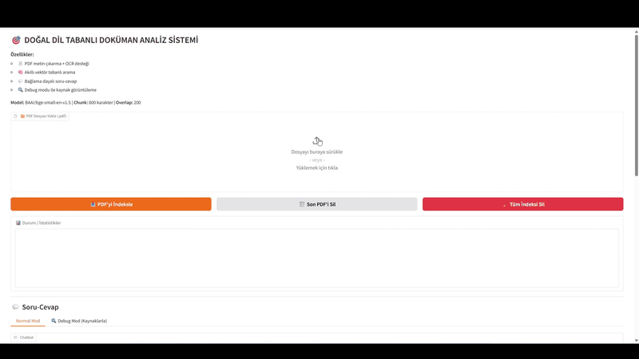

# 🤖 Doğal Dil Tabanlı Doküman Analiz Sistemi

Bu proje, yerel olarak çalışan (Local RAG) yapay zeka destekli bir doküman analiz sistemidir. Türkçe PDF dokümanlarını okur, OCR ile metne dönüştürür, vektörel olarak indeksler ve sorduğunuz sorulara doküman içeriğine sadık kalarak cevap verir.

Arayüz **Gradio**, vektör veritabanı **ChromaDB**, embedding modeli **FastEmbed (BAAI/bge)** ve OCR motoru **Tesseract** üzerine kuruludur.

[](https://www.youtube.com/watch?v=gpgWwUZe2bg)



## ⭐ Öne Çıkan Özellikler

- **📄 Gelişmiş PDF İşleme:** Metin içeren PDF'lerin yanı sıra, taranmış (resim formatındaki) PDF'leri de **OCR (Tesseract)** ile okuyabilir.
- **🧠 Akıllı RAG (Retrieval-Augmented Generation):** Dokümanları anlamsal parçalara böler ve sorunuzla en alakalı kısımları bularak cevap üretir.
- **🔍 Debug Modu:** Modelin cevabı üretirken hangi kaynakları kullandığını, benzerlik skorlarını ve metin parçalarını detaylıca görebilirsiniz.
- **📝 Otomatik Özetleme:** Belgenin içeriğini belirlediğiniz madde sayısına göre otomatik olarak özetleyebilir.
- **🔒 %100 Gizlilik:** İnternet gerektirmez, verileriniz tamamen yerel makinenizde işlenir.
- **🗑️ Veri Yönetimi:** İndekslenen belgeleri tek tek (son yüklenen) veya topluca silebilirsiniz.
- **💾 Sohbet Günlüğü:** Tüm soru ve cevaplarınız `chat_history.csv` dosyasında tarihçeli olarak tutulur.

---

## 🛠️ Gereksinimler

Projenin çalışması için aşağıdakiler gereklidir:

1. **Python 3.8+**
2. **Tesseract OCR:** (Windows için `tesseract.exe`)
3. **Yerel LLM Sunucusu:** (Örn: Llama.cpp server, Ollama vb. - OpenAI uyumlu bir API sağlamalıdır)

---

## 🚀 Kurulum

### 1. Kütüphaneleri Yükleyin

Gerekli Python paketlerini yüklemek için proje dizininde şu komutu çalıştırın:

```bash
pip install -r requirements.txt
```

### 2. Tesseract OCR Kurulumu

Windows kullanıyorsanız, [Tesseract installer](https://github.com/UB-Mannheim/tesseract/wiki) indirip kurun. Varsayılan yol: `C:\Program Files\Tesseract-OCR\tesseract.exe`.
Farklı bir yola kurduysanız, çevre değişkeni veya `.env` ayarı yapmanız gerekir.

### 3. LLM Sunucusunu Başlatın

Uygulama varsayılan olarak `http://127.0.0.1:8080/v1` adresindeki yerel bir LLM sunucusuna bağlanır (Llama.cpp server gibi). Sunucunuzu başlatın.

**Örnek Llama.cpp Başlatma:**

```bash
./server.exe -m models/Turkish-Llama-8b-Instruct-v0.1.Q4_K_S.gguf -c 2048 --host 0.0.0.0 --port 8080
```

---

## 🖥️ Kullanım

Uygulamayı başlatmak için:

```bash
python app_rag.py
```

Uygulama açıldığında tarayıcınızdan **`http://localhost:7861`** adresine gidin.

### Adım Adım Kullanım

1. **Dosya Yükleme:** "📁 PDF Dosyası Yükle" bölümünden PDF belgenizi seçin.
2. **İndeksleme:** "📥 PDF'yi İndeksle" butonuna basın. (Sistem belgeyi okuyacak, gerekirse OCR yapacak ve embeddingleri oluşturacaktır).
3. **Soru Sorma:**
    - **Normal Mod:** Doğrudan sorunuzu sorun ve cevabı alın.
    - **Debug Mod:** "🔍 Debug Mod" sekmesine geçerek, cevabın hangi kaynaktan geldiğini ve benzerlik skorlarını görebilirsiniz.
4. **Özetleme:** Sayfanın altındaki "📝 Belge Özeti" bölümünden madde sayısını seçip "Özet Oluştur" diyerek belgenin hızlı bir özetini alabilirsiniz.
5. **İndeks Yönetimi:**
    - **Son PDF'i Sil:** "🗑️ Son PDF'i Sil" butonu ile en son eklediğiniz belgeyi veritabanından kaldırabilirsiniz.
    - **Tüm İndeksi Sil:** "🧹 Tüm İndeksi Sil" butonu ile tüm veritabanını sıfırlayabilirsiniz.

---

## ⚙️ Yapılandırma (Environment Variables)

Uygulama, sistem çevre değişkenlerini (Environment Variables) kullanarak yapılandırılabilir:

| Değişken | Varsayılan Değer | Açıklama |
| :--- | :--- | :--- |
| `LLM_API_URL` | `http://127.0.0.1:8080/v1` | Yerel LLM sunucusunun API adresi. |
| `TESSERACT_CMD` | `C:\Program Files\Tesseract-OCR\tesseract.exe` | Tesseract OCR çalıştırılabilir dosya yolu. |
| `GRADIO_SERVER_NAME` | `127.0.0.1` | Arayüzün yayınlanacağı IP adresi. |

---

## 📂 Dosya Yapısı

```text
Proje/
├── rag_store/          # Vektör veritabanı (Otomatik oluşur - ChromaDB)
│   └── chat_history.csv # Sohbet geçmişi günlüğü
├── app_rag.py          # Ana uygulama kodu (Gradio + RAG mantığı)
├── requirements.txt    # Gerekli Python kütüphaneleri
├── README.md           # Dokümantasyon
└── .gitignore          # Git tarafından yok sayılacak dosyalar
```
